# 🏪 Store App
A full-featured online store backend built with Java & Spring Boot — focused on security, scalability, and clean architecture.

---

## 📘 Project Overview
Store App is a complete backend application for an online store, designed with Spring Boot and Java.  
It provides a robust and secure system for user authentication, product management, shopping cart, and order handling — following modern backend development standards and clean architecture principles.

The project demonstrates real-world backend development using modular design, validation, exception handling, and full test coverage.

---

## 🚀 Features

### 👤 User Management
- User registration and login
- JWT-based authentication and refresh token mechanism
- Role-based access control (User / Admin)
- Account management (update, delete, view profile)
- Secure endpoints with Spring Security
- Full profile management system

### 🛒 Store Management
- Product management (add, update, delete, view)
- Category management
- Strong DTO validation
- Add products to the shopping cart
- Create orders based on saved cart data
- Database integration using Spring Data JPA and Hibernate

### ⚙️ Application Structure
- Global Exception Handling
- Custom exception classes for specific error cases
- MapStruct for mapping between DTOs and entities
- Lombok for reducing boilerplate code and improving readability
- 

---

## 🧠 Technologies Used

| Category          | Technologies                                                |
|-------------------|-------------------------------------------------------------|
| Framework         | Spring Boot (v3.5.4)                                        |
| Databases         | MySQL, H2 (for testing)                                     |
| Security          | Spring Security, JWT (jjwt)                                 |
| Data Management   | Spring Data JPA                                             |
| Validation        | Spring Starter Validation                                   |
| Mapping           | MapStruct                                                   |
| Code Optimization | Lombok                                                      |
| Testing           | JUnit, AssertJ, Mockito, MockMvc, Spring Boot Security Test |

---

## 🧪 Testing & Monitoring
The project has been fully tested and monitored using:
- Postman — for API testing
- Swagger UI — for API documentation and visualization
---

## 📈 Key Highlights
- RESTful API design following SOLID principles
- JWT Authentication & Authorization with refresh token support
- Well-structured Global Exception Handling
- High test coverage using MockMvc and Mockito
- Clean, modular, and maintainable codebase
- Layer separation based on  interfaces


---

## 🧰 Tools & Environment
> - IDE: IntelliJ IDEA
> - Build Tool: Maven
> - Version Control: Git & GitHub

---

## 💬 Conclusion
Store App is not just a demo project — it’s a realistic simulation of a production-level online store backend.  
It integrates advanced security, validation, and clean architecture to provide a professional backend solution ready for real-world deployment.

---

## 🖼️ Screenshots

### 📂 Project Structure
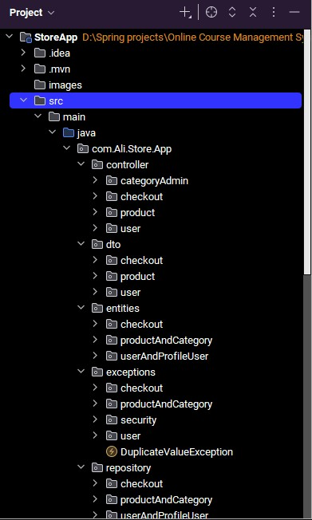
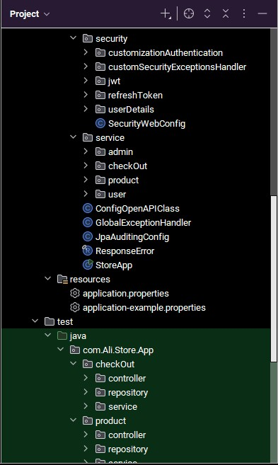
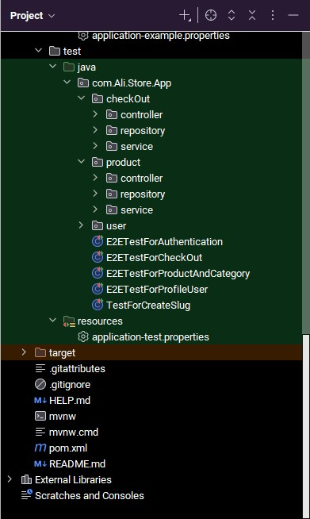

### 📸API Endpoints Overview(Swagger UI)
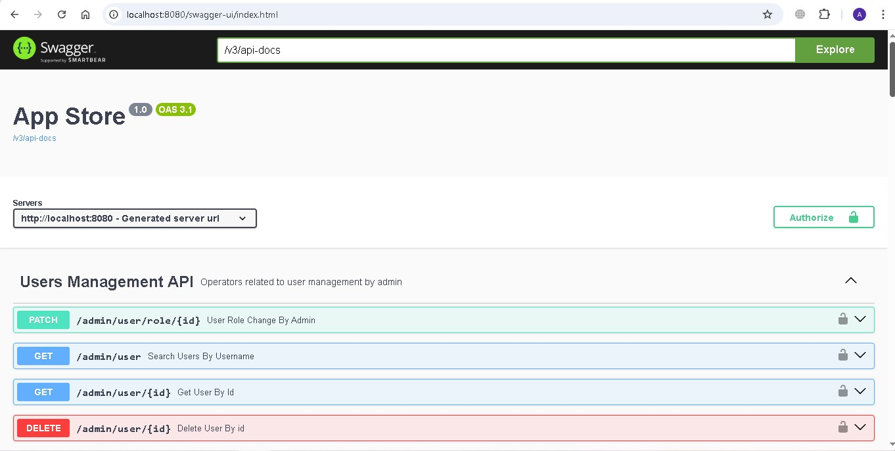
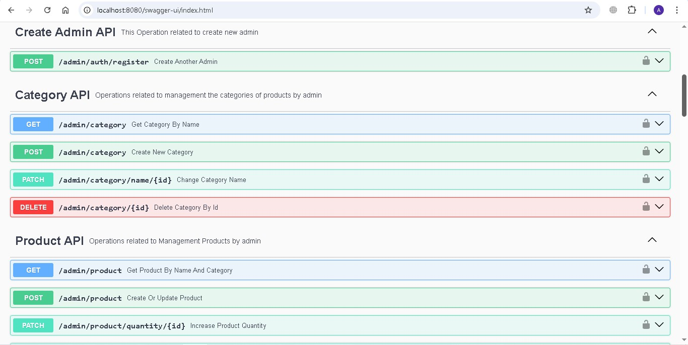
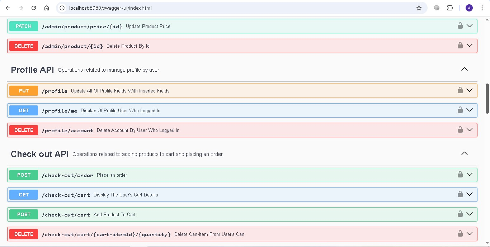
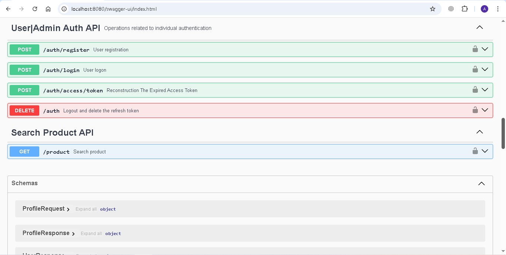

### 🔐 Authentication(Resister With Username, Password And DeviceId)
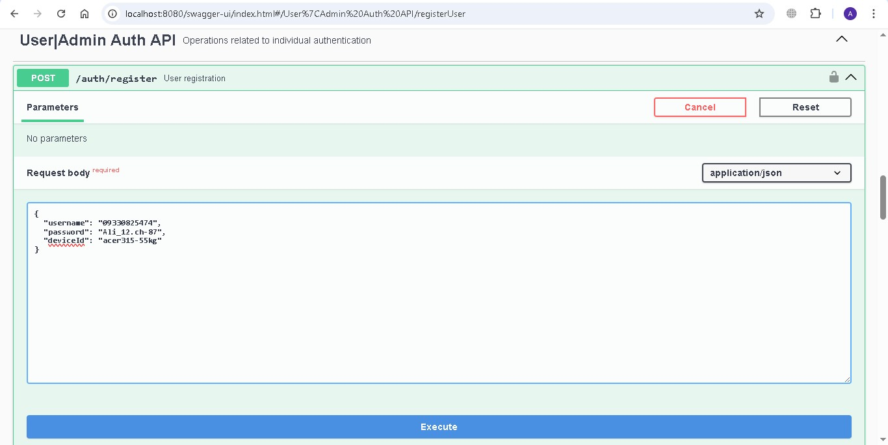
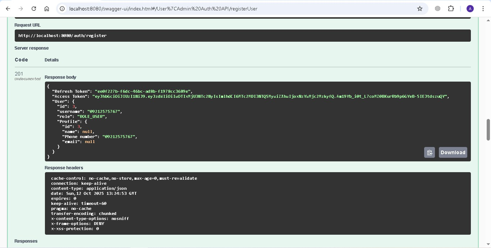

### 🔑 Authentication(Login With Username, Password And DeviceId)
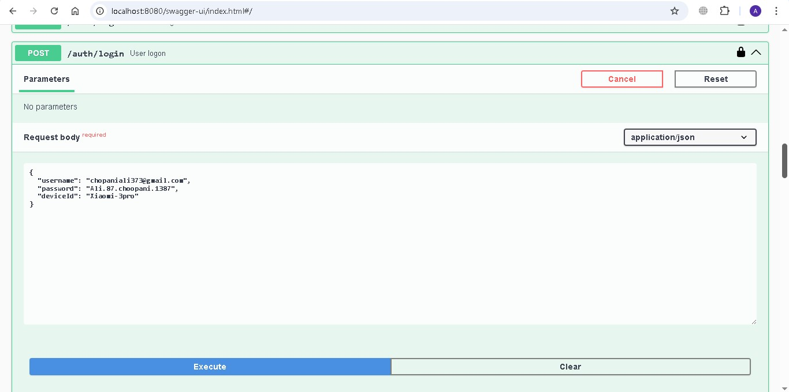
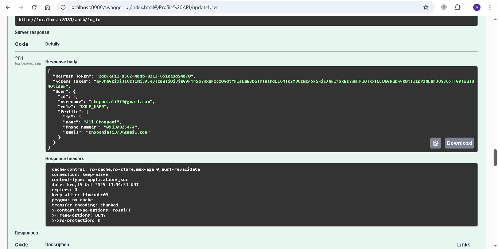

### 🔄 Reconstruction The Expired Access Token With Saved Refresh Token
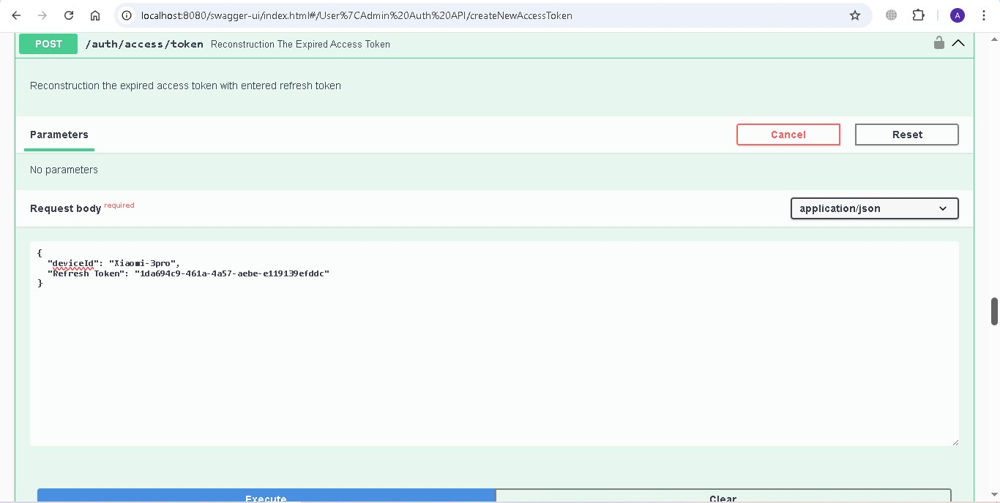
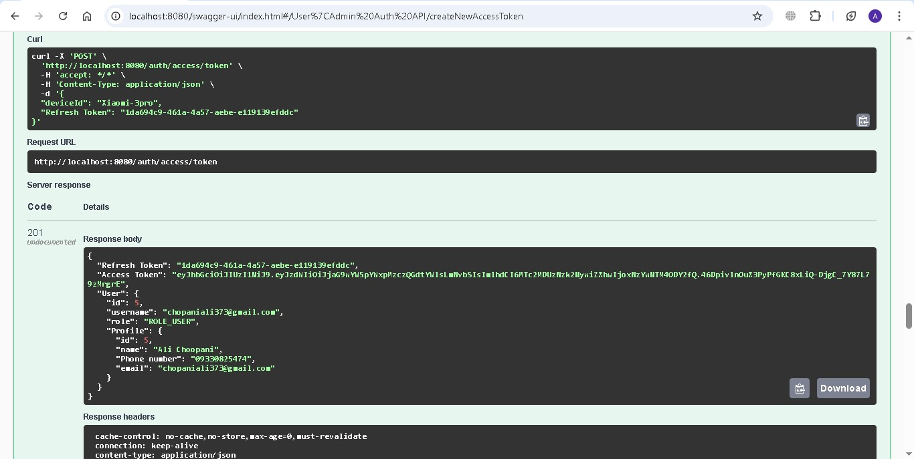

### 📥 Add A Product To Stock
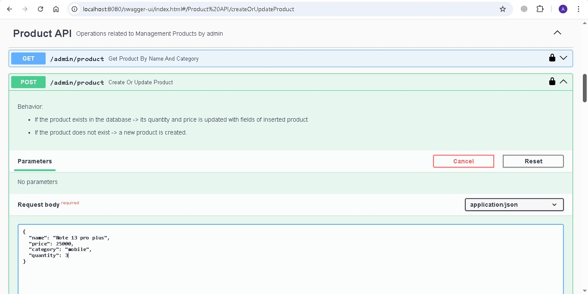
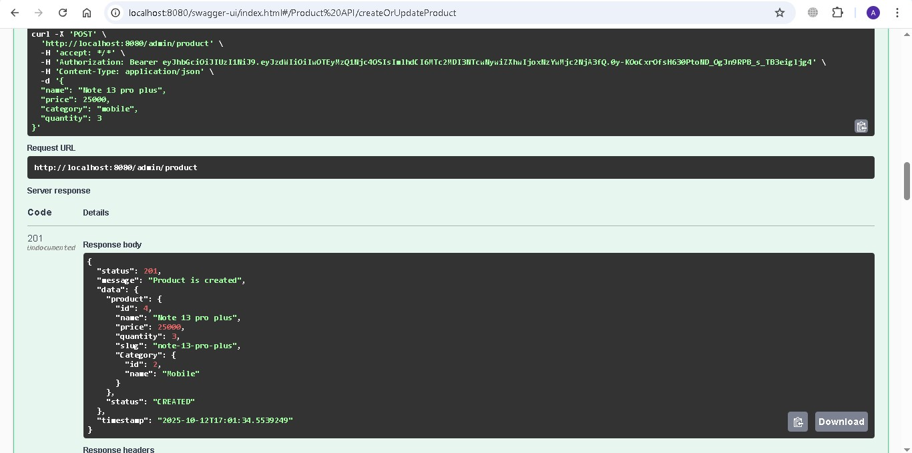

### 📥 Add A Product To User's Cart
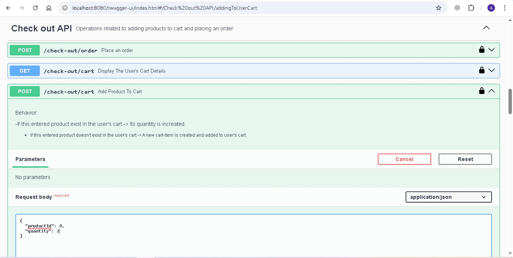
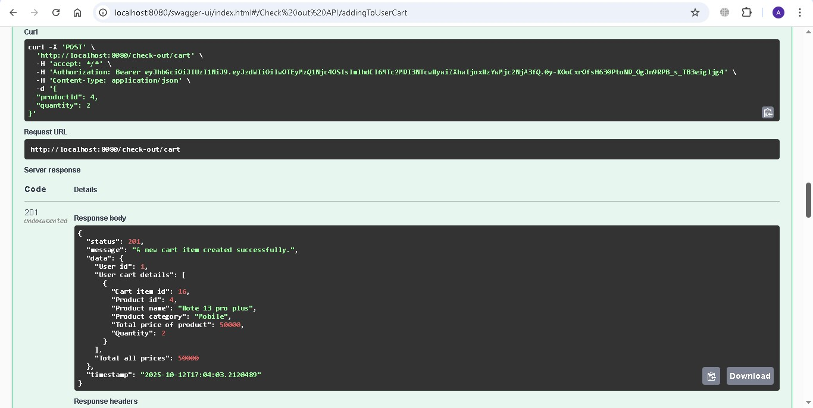

### 🛒 Place An Order
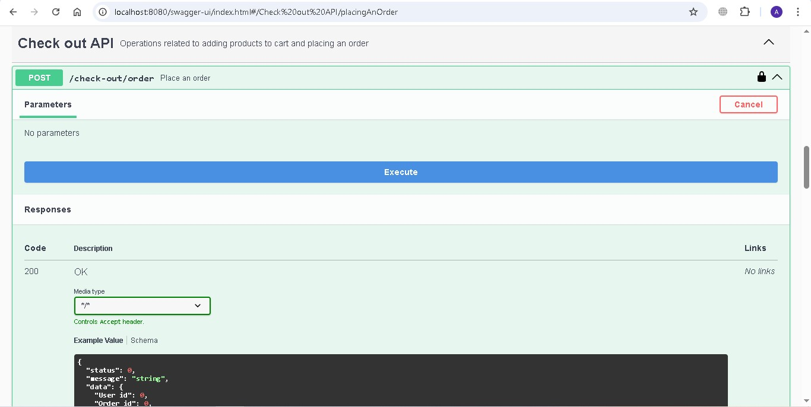
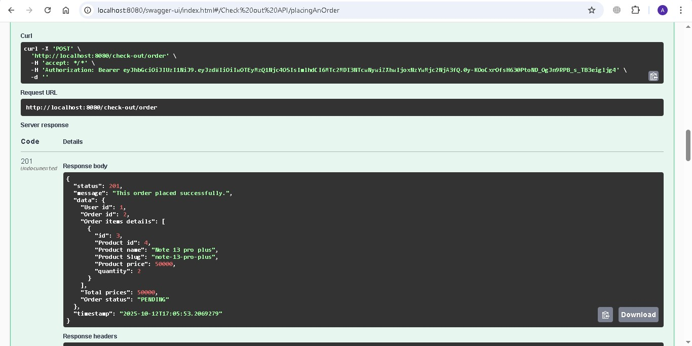

---


## 🚀 How to Run the Project

Follow these steps to set up and run the Store App project locally.

### 🔹 1. Prerequisites

Before running the project, make sure you have
installed:

- Java 17 or higher
- Maven
- MySQL Server
- IntelliJ IDEA(recommended)

### 🔹 2. Clone the repository
```bash
git clone https://github.com/AliChoopani08/store-app.git
cd store-app
```
### 🔹 3. Set up the database
You can run the project using either H2 (in-memory) or MySQL, depending on your environment.

🧩 Option 1 – Use H2 (for demo or testing)<br>
No setup required.
Just run the application — it will automatically start using the H2 in-memory database.<br>

🧩 Option 2 – Use MySQL<br>
1. Make sure MySQL is installed and running.
2. Create a database:
 ``` CREATE DATABASE store_app```
3. Update your database credentials in `src/main/resources/application.properties:`
```properties
spring.datasource.url=jdbc:mysql://localhost:3306/store_app
spring.datasource.username=your_mysql_username
spring.datasource.password=your_mysql_password
```

### 🔹 4. Build and run the project
Use **Maven** to build and start the application:
```Bash
bash

mvn clean install
mvn spring-boot:run
```
Or simply click **Run** ▶️ in IntelliJ IDEA.


### 🔹 5. Access the application
Once the app is running locally:

| Service                  | URL                                         |
|--------------------------|---------------------------------------------|
| 🌐 Main API              | http://localhost:8080                       |
| 📘 Swagger UI (API Docs) | http://localhost:8080/swagger-ui/index.html |
| 🧩 H2 Console            | http://localhost:8080/h2-console            |


### 🔹 6. Test the APIs
You can test all endpoints using:

- 🧪 Postman
- 📘 Swagger UI
 
Most endpoints require JWT authentication.
To obtain a valid token:
1. Register a new user via /auth/register
2. Copy the **"Access Token"** from the response
3. Use it in the Authorization Header:
`Authorization: Bearer <your_token>`

---

## 🧠 7. Run tests
Run all unit and integration tests with:

```Bash
mvn test
```

The project includes tests using:
- ✅ JUnit 5
- 🧩 AssertJ
- 🔐 Spring Boot Security Test
- 🧪 MockMvc
- 🧰 Mockito
- 
---

## 💡 Tip
If you want to switch between H2 and MySQL,<br>
simply edit the active profile in **application.properties** or use a separate file<br>
like **application-test.properties**.

---

## 👨‍💻 Developer
👤 Ali Choopani  
📧 [chopaniali373@gmail.com]<br>
📞📱 (09330825474)<br>  

💼 Backend Developer | Java | Spring Boot | SQL

---
